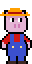
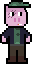
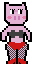

Projeto da UC de Desenvolvimento de Games baseado na história dos Três Porquinhos, mas um deles é um stripper e o Lobo Mau é um agiota.

## Historia

Era um a vez três porquinhos: Lombinho, Panceta e Toicinho.
Os irmãos viviam em paz e felizes. Porém, um a dívida antiga que Lombinho tinha com o lobo agiota, Marco Aurélio, será cobrada.
Sem dinheiro para pagar, Lombinho terá que correr, se esconder e contar com seus irmãos para não virar bacon.

## Personagens

### Lombinho
O porco fazendeiro e o irmão mais novo.

### Panceta
O porco caçador e o irmão do meio.

### Toicinho
O porco stripper e o irmão mais novo.

